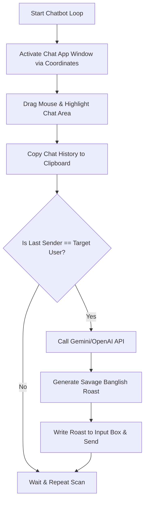

# 💬 AI Auto-Reply Chatbot (Naruto) 🤖🔥

[](https://www.python.org/)
[](LICENSE)
[](#-how-it-works)

An autonomous GUI automation chatbot named **Naruto** that monitors chat histories (specifically tested on WhatsApp Desktop/Web and Chrome), extracts conversation context, and uses state-of-the-art LLMs (Gemini / OpenAI) to generate and auto-send **highly savage, humorous, and customized "Banglish" replies** with matching emojis! 

Developed using raw HTTP requests (via standard Python libraries) to keep external package dependencies to an absolute minimum.

---

## ✨ Features

- **🌐 Smart Platform Agnostic:** Uses coordinates-based GUI automation (`pyautogui`), making it compatible with WhatsApp Desktop, Discord, Slack, or any web-based messenger open on your screen.
- **⚡ Lightweight Engine:** Built with raw `urllib` calls for AI inference. No need to install heavy SDKs like `google-generativeai` or `openai`.
- **🗣️ Hilarious Banglish Persona:** Generates witty, friendly, and savage roasts in **Banglish** (Bengali written in English alphabet mixed with English) styled with emojis.
- **🎯 Targeting System:** Only responds if the last message in the selected region is from your specified target user (e.g. `Mummy`, `Rohan Das`).
- **🛡️ Robust Security Bypass:** Manually handles macOS SSL verification issues out of the box to prevent local certificate errors (`[SSL: CERTIFICATE_VERIFY_FAILED]`).

---

## 🛠️ Tech Stack & Requirements

- **Language:** Python 3.8+
- **Libraries:**
  - `pyautogui` (for automating clicks, drags, and keystrokes)
  - `pyperclip` (for fast clipboard interaction)

---

## 🚀 Setup & Installation

### 1. Clone the Repository
```bash
git clone https://github.com/Asphane/Auto-Reply-AI-ChatBot.git
cd Auto-Reply-AI-ChatBot/auto-reply-AI-chatbot
```

### 2. Set Up Virtual Environment & Dependencies
Create a clean environment and install GUI automation requirements:
```bash
python3 -m venv .venv
source .venv/bin/activate
pip install -r req.txt
```

### 3. Configure the `.env` File
Create a `.env` file in the `auto-reply-AI-chatbot` folder matching the structure below:

```env
# LLM API Provider Configuration ('gemini' or 'openai')
LLM_PROVIDER=gemini

# API Keys (Provide at least one)
GEMINI_API_KEY=your_gemini_api_key_here
OPENAI_API_KEY=your_openai_api_key_here

# Target User Name (Bot replies only if the last message belongs to this name)
TARGET_USER="Mummy"

# Screen Coordinates for PyAutoGUI
CHROME_ICON_X=978
CHROME_ICON_Y=891

DRAG_START_X=524
DRAG_START_Y=244

DRAG_END_X=1170
DRAG_END_Y=779

INPUT_BOX_X=933
INPUT_BOX_Y=818
```

---

## 🎯 Coordinate Calibration

Before running the chatbot, you must calibrate the exact pixel positions of elements on your screen. 

1. Launch the calibrator utility:
   ```bash
   python get_coordinates.py
   ```
2. Hover your mouse over the following targets to capture their `(X, Y)` coordinates:
   - **Messenger/Chrome Icon:** The application icon on your system dock or taskbar to bring it into focus.
   - **Drag Start:** The top-left corner of the message history panel.
   - **Drag End:** The bottom-right corner of the message history panel (just above the input text bar).
   - **Input Box:** The text entry area where you type messages.
3. Save the coordinates to your `.env` file.

---

## ⚙️ How It Works



1. **Activate Window:** Clicks on the application launcher icon coordinate to put focus on the chat app.
2. **Text Scanning:** Safely drags the cursor from `DRAG_START` to `DRAG_END`, triggering a copy event (`Cmd+C` or `Ctrl+C`).
3. **Target Assessment:** Parses the clipboard text. If the last message matches the `TARGET_USER`, it starts generating.
4. **AI Generation:** Packages the context and prompts the selected LLM to reply under the persona of **Naruto**.
5. **Autosend:** Clicks the `INPUT_BOX` coordinate, pastes the generated text, and simulates the `Enter` key.

---

## 🤖 Persona Settings

You can customize Naruto's personality by modifying the prompt in `main.py` ([lines 53-61](file:///Users/bisakhpatra/Downloads/Personal/PYTHON/auto-reply-AI-chatbot/main.py#L53-L61)):
```python
prompt = (
    f"You are a wildly hilarious and savage virtual assistant named Naruto. "
    f"You need to write a witty, friendly roast/reply to the latest message in this chat history. "
    # Change language or response parameters here!
)
```

---

## ⚠️ Important Operating System Permissions (macOS)
Since the script simulates mouse cursor movements and keystrokes, your OS will block it by default. 
- Go to **System Settings > Privacy & Security > Accessibility**.
- Toggle on permission for your **Terminal / Code Editor** (e.g., VS Code or Terminal.app) running the script.

---

## 📄 License
Distributed under the MIT License. See [LICENSE](file:///Users/bisakhpatra/Downloads/Personal/PYTHON/LICENSE) for more information.
